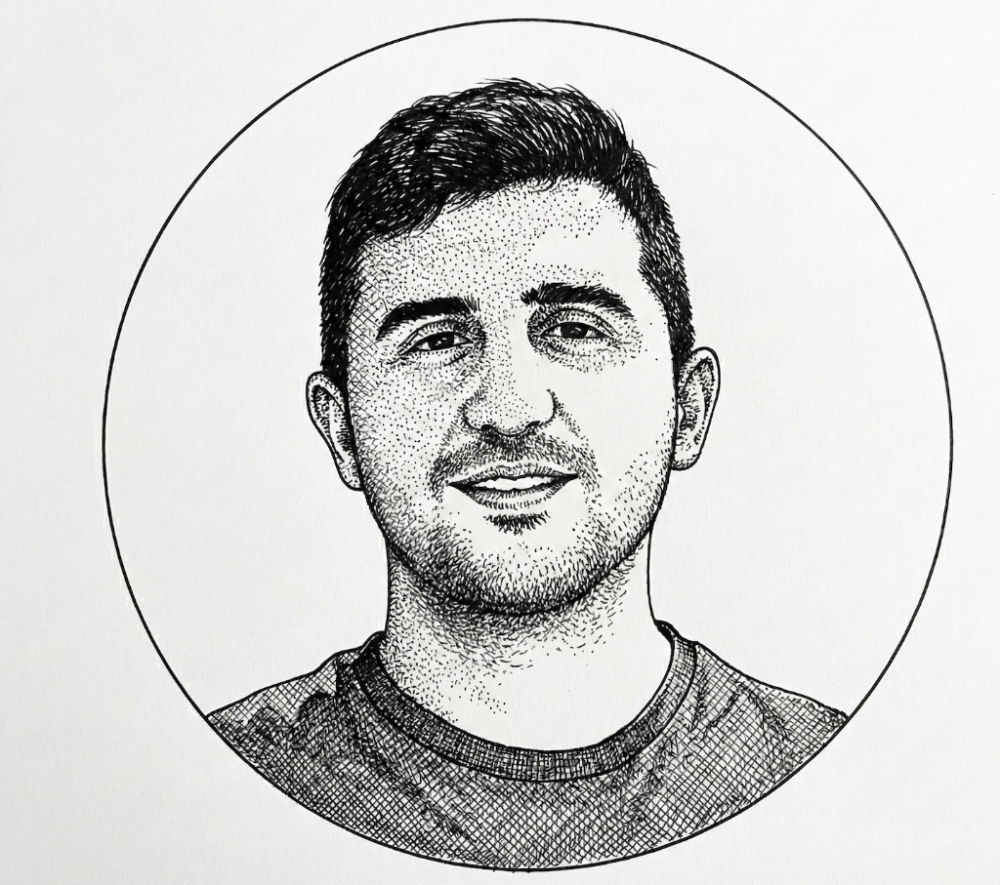

<section class="hero-section">

<h1 class="home-name">Muhammet Özkaraca</h1>

Political Science Ph.D. Student UNC-Chapel Hill

<a href="mailto:ozkaraca@unc.edu">ozkaraca@unc.edu</a>

<a href="/research">Research</a> · <a href="/teaching">Teaching</a> · <a href="CV.pdf" target="_blank" rel="noopener noreferrer">CV</a>

<a href="https://www.linkedin.com/in/muhammet-ozkaraca/" target="_blank" rel="noopener noreferrer" aria-label="LinkedIn" title="LinkedIn"><i class="fa-brands fa-linkedin"></i></a>
<a href="https://github.com/muhammetozkaraca" target="_blank" rel="noopener noreferrer" aria-label="GitHub" title="GitHub"><i class="fa-brands fa-github"></i></a>
<a href="https://x.com/muhammetozkrca" target="_blank" rel="noopener noreferrer" aria-label="Twitter" title="Twitter"><i class="fa-brands fa-x-twitter"></i></a>

Hi!

My name is Muhammet Özkaraca. I am a Ph.D. student in the <a href="https://politicalscience.unc.edu/" target="_blank" rel="noopener noreferrer">Department of Political Science</a> at the University of North Carolina at Chapel Hill. My research broadly examines how domestic factors impact international outcomes. In my research agenda, I use a variety of research designs, including causal inference with observational data, randomized controlled trials, and AI-assisted survey designs.

Prior to starting my Ph.D., I worked as a project assistant at the International Centre for Migration Policy Development. I hold a master's degree in <a href="https://politicalscience.ceu.edu/" target="_blank" rel="noopener noreferrer">Political Science</a> from Central European University and completed my bachelor's degree at Bilkent University, where I majored in <a href="https://ir.bilkent.edu.tr/" target="_blank" rel="noopener noreferrer">International Relations</a> with a minor in Political Science.

</section>
